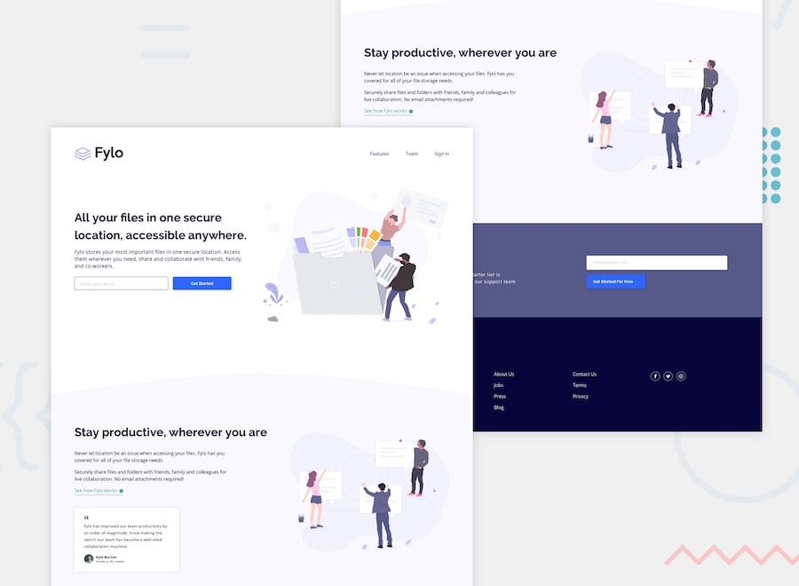

# Frontend Mentor - Fylo landing page with two column layout solution

This is a solution to the [Fylo landing page with two column layout challenge on Frontend Mentor](https://www.frontendmentor.io/challenges/fylo-landing-page-with-two-column-layout-5ca5ef041e82137ec91a50f5). Frontend Mentor challenges help you improve your coding skills by building realistic projects. 

## Table of contents

- [Overview](#overview)
  - [The challenge](#the-challenge)
  - [Links](#links)
  - [Screenshot](#screenshot)
- [My process](#my-process)
  - [Built with](#built-with)
  - [Useful resources](#useful-resources)
- [Author](#author)

### Links

- Solution URL: [URL here](https://www.frontendmentor.io/solutions/responsive-fylolandingpagewithtwocolumnlayout-bem-sass-8VZeMfjCHS)
- Live Site URL: [URL here](https://femc-fylo-landing-page.netlify.app/)

### Screenshot

- [Mobile](./assets/images/screenshots/mobile.png)
- [Tablet](./assets/images/screenshots/tablet.png)
- [Desktop](./assets/images/screenshots/desktop.png)

## My process

### Built with

- Semantic HTML5 markup
- CSS custom properties
- Flexbox
- CSS Grid
- Mobile-first workflow
- BEM
- SASS
- Custom Scrolltab

### Useful resources

- [The Current State of Styling Scrollbars in CSS](https://css-tricks.com/the-current-state-of-styling-scrollbars-in-css/)
- [Most sites have a skip-to-main link, and yours should too! | Youtube - Kelvin Powell](https://www.youtube.com/watch?v=jDDaOFr9nqQ)
- [The problem with multiple nav elements (and the simple solution) | Youtube - Kelvin Powell](https://www.youtube.com/watch?v=I1lq2ge7g4g)

## Author

- Frontend Mentor - [@xyzeez](https://www.frontendmentor.io/profile/xyzeez)
- Twitter - [@abdusamii_](https://twitter.com/abdusamii_)
